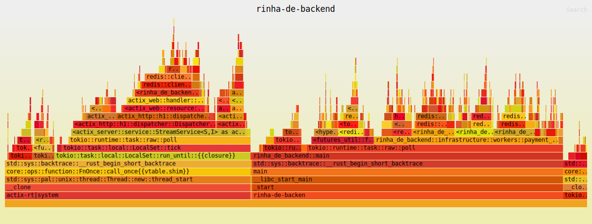
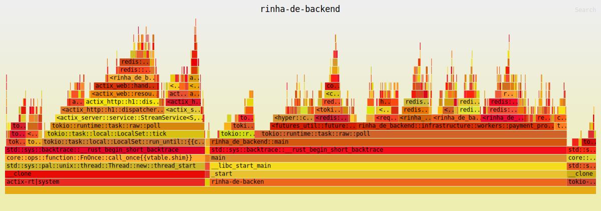
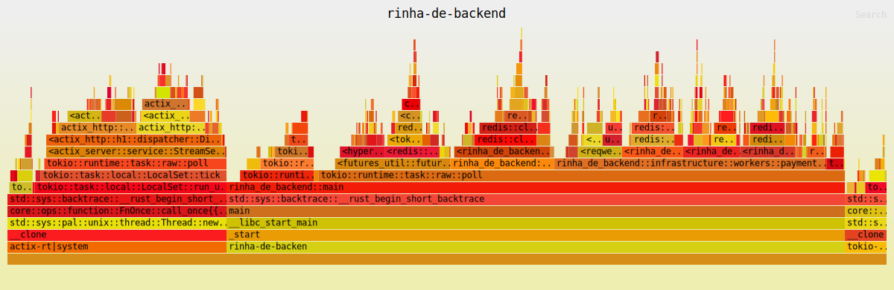
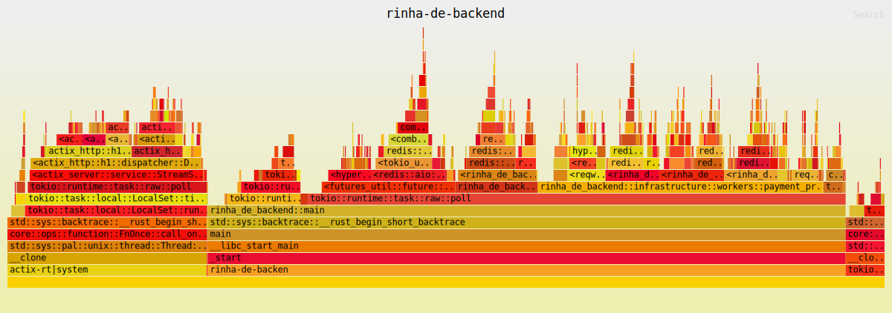
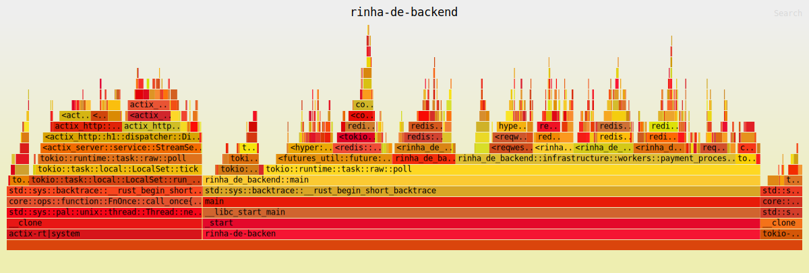
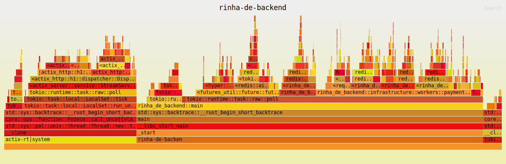
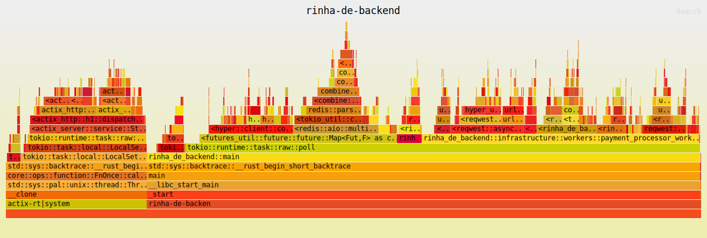
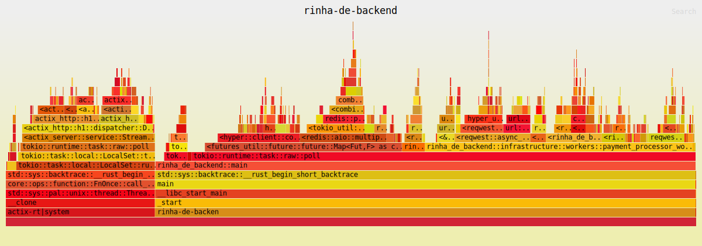
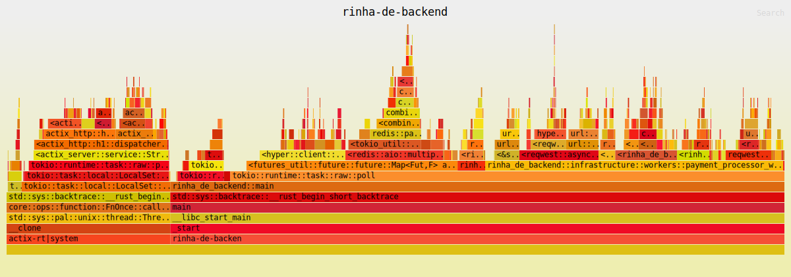
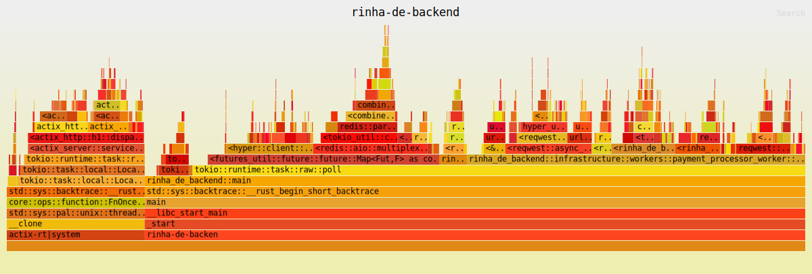

# Goal

Process payments with a P99 of 5ms

# Optimizations

- https://deterministic.space/high-performance-rust.html
- https://deterministic.space/secret-life-of-cows.html
- https://likebike.com/posts/How_To_Write_Fast_Rust_Code.html
- http://troubles.md/posts/rustfest-2018-workshop/
- https://nnethercote.github.io/perf-book/build-configuration.html

# Flamegraph Analysis

## [#107](https://github.com/josimar-silva/rinha-de-backend-2025/actions/runs/16713859094/job/47303559607)

Finally, got the [flamegraph](https://github.com/josimar-silva/rinha-de-backend-2025/actions/runs/16713859094/artifacts/3678343125) collection working. Yay!!!

Overall, there is quite a bit of CPU time being consumed by the PaymentQueue operations.
A good percentage of the time is being used to acquire the multiplexed connection to Redis.

This has a huge impact on the Payments API handler, which is propagating the requests directly to Redis.
Being locked waiting for the connection means more latency time.  
Let's see how it performs after offloading the call to Redis to a MPSC channel. 

### Backend 01

### Backend 02

## [#108](https://github.com/josimar-silva/rinha-de-backend-2025/actions/runs/16727183039)

As theorized, moving the [Payment push to a channel](https://github.com/josimar-silva/rinha-de-backend-2025/pull/20) removed the contention on the request handler. 

As shown on the performance test results bellow, all requests were successfully processed this time.

Although the requests were all processed, the payments weren't hence the `Lag` of 22423, which the diff between the requests received and the ones processed.

Let's see how we can decrease the lag next.

### Backend 01

### Backend 02

## [#109](https://github.com/josimar-silva/rinha-de-backend-2025/actions/runs/16729766895)

On [c5c68fc](https://github.com/josimar-silva/rinha-de-backend-2025/commit/c5c68fc2e6599bd15fbbb3ed0b1d07e65ade473f), we introduce
multiple instances of the `payment_processing_worker` to increase the throughput of payment processing.
The change had no effect on the `lag`. The bottleneck points to the Redis connection acquiring logic.

Instead of reusing the multiplexed connection, PaymentQueue and PaymentRepository, we are acquiring a new connection from
the client on every operation, which is quite inefficient.
In hindsight, this was a big oversight during the implementation 🤦🏽. But hey, that's why we have automated performance tests 😌.

### Backend 01

### Backend 02

## [#111](https://github.com/josimar-silva/rinha-de-backend-2025/actions/runs/16756984103)

With [#19](https://github.com/josimar-silva/rinha-de-backend-2025/pull/19), we introduced a more efficient 
way of handling multiplexed connections from Redis and safely (using [Arc](https://doc.rust-lang.org/book/ch16-03-shared-state.html?highlight=Arc#atomic-reference-counting-with-arct)) shared.

This change drastically reduced the `lag`, as can be seen in the test results.

There's a bit of contention with Redis connection, let's see if we can improve it even more and reduce the `lag` to **0**.

### Backend 01

### Backend 02

## [#115](https://github.com/josimar-silva/rinha-de-backend-2025/actions/runs/16772589656)

By using [dedicated multiplexed](https://github.com/josimar-silva/rinha-de-backend-2025/commit/35884a2bf0769351520675383e3533788b47fee8) for workers
and payment producers, we removed connection contention, which has been a bottleneck so far.

This change reduced the `lag` to **0**. Yay!!!

Now, the flamegraphs shows quite a bit of CPU time being used on serialization.
Let's see if we can improve that next.

### Backend 01

### Backend 02

# Performance Tests Results

| Test Run                                                                                | Commit SHA                                                                                                        | Timestamp            | Max. Requests | P99 (ms)            | Success Requests | Failed Requests | Lag   | Score              | Flamegraph                                                                                                         |
|-----------------------------------------------------------------------------------------|-------------------------------------------------------------------------------------------------------------------|----------------------|---------------|---------------------|------------------|-----------------|-------|--------------------|--------------------------------------------------------------------------------------------------------------------|
| [#87](https://github.com/josimar-silva/rinha-de-backend-2025/actions/runs/16559770057)  | [6eb13d6](https://github.com/josimar-silva/rinha-de-backend-2025/commit/6eb13d67e4905b88eeec17f9025b3fd72b1378b4) | 2025-07-25T13:53:29Z | 1000          | 60.24655469999998ms | 7337             | 9551            | 7337  | 0                  | N/A                                                                                                                |
| [#88](https://github.com/josimar-silva/rinha-de-backend-2025/actions/runs/16562894079)  | [f6bac2f](https://github.com/josimar-silva/rinha-de-backend-2025/commit/f6bac2fce7bea700a0fc80da2eaca448187df9cf) | 2025-07-25T13:56:06Z | 1000          | 1402.7065316ms      | 8441             | 8681            | 8441  | 0                  | N/A                                                                                                                |
| [#89](https://github.com/josimar-silva/rinha-de-backend-2025/actions/runs/16563537280)  | [5ac0e74](https://github.com/josimar-silva/rinha-de-backend-2025/commit/5ac0e7415a0b6b8f3f23ac7bcffe17a7287d7704) | 2025-07-28T04:07:33Z | 1000          | 1117.29ms           | 8317             | 8792            | 8317  | 0                  | N/A                                                                                                                |
| [#91](https://github.com/josimar-silva/rinha-de-backend-2025/actions/runs/16575538619)  | [e4cfaca](https://github.com/josimar-silva/rinha-de-backend-2025/commit/e4cfacad7127c0c135f9990bb1eb4ff2ad944169) | 2025-07-28T07:30:03Z | 1000          | 81.99ms             | 7342             | 9526            | 7342  | 0                  | N/A                                                                                                                |
| [#92](https://github.com/josimar-silva/rinha-de-backend-2025/actions/runs/16575864980)  | [4ca14c2](https://github.com/josimar-silva/rinha-de-backend-2025/commit/4ca14c2858883ad6a19774510d6cfee4e45886d8) | 2025-07-28T08:02:52Z | 1000          | 74.23ms             | 7290             | 9541            | 7290  | 0                  | N/A                                                                                                                |
| [#93](https://github.com/josimar-silva/rinha-de-backend-2025/actions/runs/16577706611)  | [abc98cd](https://github.com/josimar-silva/rinha-de-backend-2025/commit/abc98cd7fbe850264836f55cc30ba5b092a37476) | 2025-07-28T17:13:22Z | 1000          | 1364.99ms           | 7584             | 9245            | 7584  | 0                  | N/A                                                                                                                |
| [#94](https://github.com/josimar-silva/rinha-de-backend-2025/actions/runs/16577763153)  | [3473249](https://github.com/josimar-silva/rinha-de-backend-2025/commit/347324997764c428bd698710715f4b1b52f5180b) | 2025-07-28T17:29:17Z | 1000          | 1242.5ms            | 8423             | 8738            | 8423  | 0                  | N/A                                                                                                                |
| [#95](https://github.com/josimar-silva/rinha-de-backend-2025/actions/runs/16578734465)  | [b460cb5](https://github.com/josimar-silva/rinha-de-backend-2025/commit/b460cb5b81f843b641c4752f7621ac692b06aa5f) | 2025-07-28T18:57:07Z | 1000          | 1395.43ms           | 7627             | 9239            | 7627  | 0                  | N/A                                                                                                                |
| [#96](https://github.com/josimar-silva/rinha-de-backend-2025/actions/runs/16579171194)  | [9464402](https://github.com/josimar-silva/rinha-de-backend-2025/commit/9464402ad8aeb8e13a019c83776418420a162a81) | 2025-07-28T18:59:55Z | 1000          | 1372.76ms           | 8114             | 8906            | 8114  | 0                  | N/A                                                                                                                |
| [#97](https://github.com/josimar-silva/rinha-de-backend-2025/actions/runs/16586425395)  | [f6b637a](https://github.com/josimar-silva/rinha-de-backend-2025/commit/f6b637ac4594cf1e08f2ec63f84c89d731e72286) | 2025-07-28T20:09:42Z | 1000          | 62.45ms             | 7294             | 9562            | 7294  | 0                  | N/A                                                                                                                |
| [#98](https://github.com/josimar-silva/rinha-de-backend-2025/actions/runs/16613167118)  | [32cdeb9](https://github.com/josimar-silva/rinha-de-backend-2025/commit/32cdeb9a3013f7634200a12d252d1da6467f6bf8) | 2025-07-29T04:09:53Z | 1000          | 1406.43ms           | 8264             | 8714            | 8264  | 0                  | N/A                                                                                                                |
| [#99](https://github.com/josimar-silva/rinha-de-backend-2025/actions/runs/16639527158)  | [abe997d](https://github.com/josimar-silva/rinha-de-backend-2025/commit/abe997dc223f1b93bfa010f5c91d00691fb831fe) | 2025-07-30T04:05:39Z | 1000          | 1318ms              | 7780             | 9161            | 7780  | 0                  | N/A                                                                                                                |
| [#100](https://github.com/josimar-silva/rinha-de-backend-2025/actions/runs/16666121730) | [7b77e4c](https://github.com/josimar-silva/rinha-de-backend-2025/commit/7b77e4c38d435ce30748c140cd5289f7c5a57c93) | 2025-07-31T04:04:49Z | 1000          | 1312.38ms           | 8002             | 9021            | 8002  | 0                  | N/A                                                                                                                |
| [#101](https://github.com/josimar-silva/rinha-de-backend-2025/actions/runs/16669843009) | [1591b81](https://github.com/josimar-silva/rinha-de-backend-2025/commit/1591b8134e320ff7ccd6486c587d29c086e23802) | 2025-08-01T04:16:07Z | 1000          | 73.1ms              | 7304             | 9555            | 7304  | 0                  | N/A                                                                                                                |
| [#102](https://github.com/josimar-silva/rinha-de-backend-2025/actions/runs/16672986226) | [0da19ab](https://github.com/josimar-silva/rinha-de-backend-2025/commit/0da19ab114026b83297dc7c84c06f99f0fb3e008) | 2025-08-01T08:07:58Z | 1000          | 1397.67ms           | 8139             | 8831            | 8139  | 0                  | N/A                                                                                                                |
| [#103](https://github.com/josimar-silva/rinha-de-backend-2025/actions/runs/16677680995) | [11bc22e](https://github.com/josimar-silva/rinha-de-backend-2025/commit/11bc22e3ce7964f76f1d88b166cf0efcee53a462) | 2025-08-01T14:31:35Z | 1000          | 84.54ms             | 7251             | 9567            | 7251  | 0                  | N/A                                                                                                                |
| [#105](https://github.com/josimar-silva/rinha-de-backend-2025/actions/runs/16678138338) | [110e86c](https://github.com/josimar-silva/rinha-de-backend-2025/commit/110e86cf5c1c1811e9421d8051bf36fee5a85420) | 2025-08-01T14:52:36Z | 1000          | 1272.24ms           | 8416             | 8724            | 8416  | 0                  | N/A                                                                                                                |
| [#106](https://github.com/josimar-silva/rinha-de-backend-2025/actions/runs/16678910803) | [816e9ce](https://github.com/josimar-silva/rinha-de-backend-2025/commit/816e9ce0f52028bf131e49236ff2a11ea7c405bf) | 2025-08-01T15:28:02Z | 1000          | 1335.23ms           | 8119             | 8987            | 8119  | 0                  | [Flamegraph](https://github.com/josimar-silva/rinha-de-backend-2025/actions/runs/16678910803/artifacts/3668455362) |
| [#107](https://github.com/josimar-silva/rinha-de-backend-2025/actions/runs/16713859094) | [bcd7241](https://github.com/josimar-silva/rinha-de-backend-2025/commit/bcd724190efbb55af38c7387fe5adf2cbbe067e6) | 2025-08-04T04:18:30Z | 1000          | 81.85ms             | 7332             | 9542            | 7332  | 0                  | [Flamegraph](https://github.com/josimar-silva/rinha-de-backend-2025/actions/runs/16713859094/artifacts/3678343125) |
| [#108](https://github.com/josimar-silva/rinha-de-backend-2025/actions/runs/16727183039) | [a8b13cc](https://github.com/josimar-silva/rinha-de-backend-2025/commit/a8b13cca38f66c2e38ef0e954cf143cbae0b2e34) | 2025-08-04T15:20:26Z | 1000          | 49.73ms             | 30231            | 0               | 22423 | 135610.53999999244 | [Flamegraph](https://github.com/josimar-silva/rinha-de-backend-2025/actions/runs/16727183039/artifacts/3682892137) |
| [#109](https://github.com/josimar-silva/rinha-de-backend-2025/actions/runs/16729766895) | [c5c68fc](https://github.com/josimar-silva/rinha-de-backend-2025/commit/c5c68fc2e6599bd15fbbb3ed0b1d07e65ade473f) | 2025-08-04T17:22:33Z | 1000          | 49ms                | 30359            | 0               | 22528 | 137159.7549999934  | [Flamegraph](https://github.com/josimar-silva/rinha-de-backend-2025/actions/runs/16729766895/artifacts/3683929073) |
| [#110](https://github.com/josimar-silva/rinha-de-backend-2025/actions/runs/16740294991) | [b6abb71](https://github.com/josimar-silva/rinha-de-backend-2025/commit/b6abb71bcd6bc8893106773e737241660e7b5e2c) | 2025-08-05T04:09:59Z | 1000          | 51.32ms             | 30229            | 0               | 21983 | 144911.79999999434 | [Flamegraph](https://github.com/josimar-silva/rinha-de-backend-2025/actions/runs/16740294991/artifacts/3687513186) |
| [#111](https://github.com/josimar-silva/rinha-de-backend-2025/actions/runs/16756984103) | [203d983](https://github.com/josimar-silva/rinha-de-backend-2025/commit/203d983da66ec5c548d827aa4cdb0e6689fae8bf) | 2025-08-05T17:34:45Z | 1000          | 3.23ms              | 30448            | 0               | 419   | 645279.7482002105  | [Flamegraph](https://github.com/josimar-silva/rinha-de-backend-2025/actions/runs/16756984103/artifacts/3693475527) |
| [#112](https://github.com/josimar-silva/rinha-de-backend-2025/actions/runs/16767258714) | [230eb14](https://github.com/josimar-silva/rinha-de-backend-2025/commit/230eb14c86c9cc1c7b28f32888622ec2fe6ed2c6) | 2025-08-06T04:07:13Z | 1000          | 3.99ms              | 30439            | 0               | 272   | 636443.2527002069  | [Flamegraph](https://github.com/josimar-silva/rinha-de-backend-2025/actions/runs/16767258714/artifacts/3697231226) |
| [#114](https://github.com/josimar-silva/rinha-de-backend-2025/actions/runs/16772077627) | [1175944](https://github.com/josimar-silva/rinha-de-backend-2025/commit/117594497da97a68bc51eccb07fc50864d46b412) | 2025-08-06T08:47:28Z | 1000          | 4.24ms              | 30459            | 0               | 0     | 642058.0377002069  | [Flamegraph](https://github.com/josimar-silva/rinha-de-backend-2025/actions/runs/16772077627/artifacts/3698777157) |
| [#115](https://github.com/josimar-silva/rinha-de-backend-2025/actions/runs/16772589656) | [3fc22bf](https://github.com/josimar-silva/rinha-de-backend-2025/commit/3fc22bf0ce265ba4518f7f8759e4d97791072e02) | 2025-08-06T09:09:59Z | 1000          | 3.51ms              | 30460            | 0               | 0     | 647743.9055002088  | [Flamegraph](https://github.com/josimar-silva/rinha-de-backend-2025/actions/runs/16772589656/artifacts/3698954567) |
| [#116](https://github.com/josimar-silva/rinha-de-backend-2025/actions/runs/16775047011) | [43eb456](https://github.com/josimar-silva/rinha-de-backend-2025/commit/43eb456774e3ea5225ab0ed2f46664b5d7c3b759) | 2025-08-06T11:02:11Z | 1000          | 3.2ms               | 30453            | 0               | 0     | 653199.8686002105  | [Flamegraph](https://github.com/josimar-silva/rinha-de-backend-2025/actions/runs/16775047011/artifacts/3699802631) |
| [#117](https://github.com/josimar-silva/rinha-de-backend-2025/actions/runs/16777608881) | [ece4eb6](https://github.com/josimar-silva/rinha-de-backend-2025/commit/ece4eb663cda17c0901fe2fe6f5510f324818767) | 2025-08-06T13:00:14Z | 1000          | 3.14ms              | 30454            | 0               | 0     | 653237.9572002105  | [Flamegraph](https://github.com/josimar-silva/rinha-de-backend-2025/actions/runs/16777608881/artifacts/3700703475) |
| [#118](https://github.com/josimar-silva/rinha-de-backend-2025/actions/runs/16778294902) | [31fa25a](https://github.com/josimar-silva/rinha-de-backend-2025/commit/31fa25aacc8f55704afd882df75c9422aacdeebe) | 2025-08-06T13:28:46Z | 1000          | 2.14ms              | 30450            | 0               | 22700 | 110335.21169998588 | [Flamegraph](https://github.com/josimar-silva/rinha-de-backend-2025/actions/runs/16778294902/artifacts/3700954876) |
| [#119](https://github.com/josimar-silva/rinha-de-backend-2025/actions/runs/16778625903) | [92327a5](https://github.com/josimar-silva/rinha-de-backend-2025/commit/92327a59cdbffd6d15b4a07fbc5ccb6a25a46ddb) | 2025-08-06T13:42:18Z | 1000          | 3.34ms              | 30450            | 0               | 0     | 647480.7280002087  | [Flamegraph](https://github.com/josimar-silva/rinha-de-backend-2025/actions/runs/16778625903/artifacts/3701083197) |
| [#120](https://github.com/josimar-silva/rinha-de-backend-2025/actions/runs/16778977004) | [3a645b1](https://github.com/josimar-silva/rinha-de-backend-2025/commit/3a645b1f29d69de77757ce6fa9c396dfd1c0c9ff) | 2025-08-06T13:56:05Z | 1000          | 3.49ms              | 30451            | 0               | 0     | 647568.8352502087  | [Flamegraph](https://github.com/josimar-silva/rinha-de-backend-2025/actions/runs/16778977004/artifacts/3701218588) |
| [#121](https://github.com/josimar-silva/rinha-de-backend-2025/actions/runs/16779762731) | [7698398](https://github.com/josimar-silva/rinha-de-backend-2025/commit/76983980cb595369488a3a264a2c623c3a3d39f0) | 2025-08-06T14:26:43Z | 1000          | 3.47ms              | 30452            | 0               | 0     | 647544.8060002088  | [Flamegraph](https://github.com/josimar-silva/rinha-de-backend-2025/actions/runs/16779762731/artifacts/3701538926) |
| [#122](https://github.com/josimar-silva/rinha-de-backend-2025/actions/runs/16779941805) | [9046c17](https://github.com/josimar-silva/rinha-de-backend-2025/commit/9046c17f663a5791f53dea4cced30724e34cf165) | 2025-08-06T14:33:31Z | 1000          | 3.97ms              | 30445            | 0               | 1444  | 625020.8517003356  | [Flamegraph](https://github.com/josimar-silva/rinha-de-backend-2025/actions/runs/16779941805/artifacts/3701607075) |
| [#123](https://github.com/josimar-silva/rinha-de-backend-2025/actions/runs/16779995440) | [5f7f11a](https://github.com/josimar-silva/rinha-de-backend-2025/commit/5f7f11a9940e23dff6ee5cc39d13b88d905ef5fe) | 2025-08-06T14:35:48Z | 1000          | 3.7ms               | 30448            | 0               | 1438  | 630699.1575003386  | [Flamegraph](https://github.com/josimar-silva/rinha-de-backend-2025/actions/runs/16779995440/artifacts/3701629814) |
| [#124](https://github.com/josimar-silva/rinha-de-backend-2025/actions/runs/16781145100) | [5740e85](https://github.com/josimar-silva/rinha-de-backend-2025/commit/5740e857612ccc58060158126ae3044c06dd56b3) | 2025-08-06T15:20:58Z | 1000          | 2.97ms              | 30443            | 0               | 618   | 654056.2850003637  | [Flamegraph](https://github.com/josimar-silva/rinha-de-backend-2025/actions/runs/16781145100/artifacts/3702105160) |
| [#125](https://github.com/josimar-silva/rinha-de-backend-2025/actions/runs/16794809334) | [f941e6f](https://github.com/josimar-silva/rinha-de-backend-2025/commit/f941e6fb6eda9b82302643e0924c9fdcaac40637) | 2025-08-07T04:07:36Z | 1000          | 3.6ms               | 30447            | 0               | 1008  | 640025.9392503496  | [Flamegraph](https://github.com/josimar-silva/rinha-de-backend-2025/actions/runs/16794809334/artifacts/3707003619) |
| [#126](https://github.com/josimar-silva/rinha-de-backend-2025/actions/runs/16799528470) | [6b3813a](https://github.com/josimar-silva/rinha-de-backend-2025/commit/6b3813a870285374ad89c415813b49f2261ebe1a) | 2025-08-07T08:41:59Z | 1000          | 3.84ms              | 30445            | 0               | 1419  | 625559.6442003356  | [Flamegraph](https://github.com/josimar-silva/rinha-de-backend-2025/actions/runs/16799528470/artifacts/3708483757) |
| [#127](https://github.com/josimar-silva/rinha-de-backend-2025/actions/runs/16806913692) | [6daa07f](https://github.com/josimar-silva/rinha-de-backend-2025/commit/6daa07f96add2dee027c0adf064ab24d296352ae) | 2025-08-07T14:11:24Z | 1000          | 4.33ms              | 30449            | 0               | 0     | 636716.0319502158  | [Flamegraph](https://github.com/josimar-silva/rinha-de-backend-2025/actions/runs/16806913692/artifacts/3711122689) |
| [#128](https://github.com/josimar-silva/rinha-de-backend-2025/actions/runs/16807399622) | [6f93a30](https://github.com/josimar-silva/rinha-de-backend-2025/commit/6f93a30cd3ed15e18e932332e2ec903a4f7fa413) | 2025-08-07T14:30:46Z | 1000 | 4.38ms | 30459 | 0 | 0 | 636963.3889502159 | [Flamegraph](https://github.com/josimar-silva/rinha-de-backend-2025/actions/runs/16807399622/artifacts/3711318761) |
| [#129](https://github.com/josimar-silva/rinha-de-backend-2025/actions/runs/16808389221) | [536fea3](https://github.com/josimar-silva/rinha-de-backend-2025/commit/536fea3b3a633bf7c7e597638c59454d1817eb81) | 2025-08-07T15:10:37Z | 1000 | 3.73ms | 30454 | 0 | 0 | 648089.4690002196 | [Flamegraph](https://github.com/josimar-silva/rinha-de-backend-2025/actions/runs/16808389221/artifacts/3711723699) |
| [#130](https://github.com/josimar-silva/rinha-de-backend-2025/actions/runs/16808986993) | [8e3c494](https://github.com/josimar-silva/rinha-de-backend-2025/commit/8e3c494ba2469f05d4804d9ba1d97d9bd9ba8d54) | 2025-08-07T15:35:31Z | 1000 | 3.61ms | 30451 | 0 | 0 | 648070.0167502196 | [Flamegraph](https://github.com/josimar-silva/rinha-de-backend-2025/actions/runs/16808986993/artifacts/3711973722) |
| [#131](https://github.com/josimar-silva/rinha-de-backend-2025/actions/runs/16809313110) | [5f30ce6](https://github.com/josimar-silva/rinha-de-backend-2025/commit/5f30ce6a7fa32b8dd9defab1e55217d3a1aa2027) | 2025-08-07T15:49:51Z | 1000 | 3.45ms | 30444 | 0 | 0 | 647970.4670002196 | [Flamegraph](https://github.com/josimar-silva/rinha-de-backend-2025/actions/runs/16809313110/artifacts/3712111161) |
| [#132](https://github.com/josimar-silva/rinha-de-backend-2025/actions/runs/16810180452) | [a9808c7](https://github.com/josimar-silva/rinha-de-backend-2025/commit/a9808c7726edd38d5f19ffb21758f704f535fc0d) | 2025-08-07T16:29:24Z | 1000 | 3.6ms | 30454 | 0 | 0 | 648050.5645002197 | [Flamegraph](https://github.com/josimar-silva/rinha-de-backend-2025/actions/runs/16810180452/artifacts/3712468836) |
| [#133](https://github.com/josimar-silva/rinha-de-backend-2025/actions/runs/16814887255) | [a05fdda](https://github.com/josimar-silva/rinha-de-backend-2025/commit/a05fddaf3e704ce8811c4e29b2a02665a06b4e4c) | 2025-08-07T20:20:02Z | 1000 | 3.32ms | 30444 | 0 | 0 | 647890.3695002197 | [Flamegraph](https://github.com/josimar-silva/rinha-de-backend-2025/actions/runs/16814887255/artifacts/3714279582) |
| [#134](https://github.com/josimar-silva/rinha-de-backend-2025/actions/runs/16821630924) | [9839dcb](https://github.com/josimar-silva/rinha-de-backend-2025/commit/9839dcbaecf4dc32537ee7088c984902db6d0cd5) | 2025-08-08T04:07:09Z | 1000 | 3.49ms | 30433 | 0 | 0 | 647669.5292502197 | [Flamegraph](https://github.com/josimar-silva/rinha-de-backend-2025/actions/runs/16821630924/artifacts/3716609464) |
| [#135](https://github.com/josimar-silva/rinha-de-backend-2025/actions/runs/16870637051) | [974e57a](https://github.com/josimar-silva/rinha-de-backend-2025/commit/974e57a345b505a7b3d9aa885d66bcb1922ccdd5) | 2025-08-11T04:07:11Z | 1000 | 3.65ms | 30420 | 0 | 0 | 647416.6500002197 | [Flamegraph](https://github.com/josimar-silva/rinha-de-backend-2025/actions/runs/16870637051/artifacts/3731165832) |
| [#136](https://github.com/josimar-silva/rinha-de-backend-2025/actions/runs/16878539225) | [5d9cc55](https://github.com/josimar-silva/rinha-de-backend-2025/commit/5d9cc55cc3a6945ee988ac663a9183e31793a73c) | 2025-08-11T11:22:01Z | 1000 | 3.9ms | 30450 | 0 | 0 | 642410.8050002177 | [Flamegraph](https://github.com/josimar-silva/rinha-de-backend-2025/actions/runs/16878539225/artifacts/3733704450) |
| [#137](https://github.com/josimar-silva/rinha-de-backend-2025/actions/runs/16898419417) | [d3bf8a6](https://github.com/josimar-silva/rinha-de-backend-2025/commit/d3bf8a60f3b0a31bc3eef7e9b5ef5aeffe20aab8) | 2025-08-12T03:50:09Z | 1000 | 3.45ms | 30449 | 0 | 0 | 647884.6482502086 | [Flamegraph](https://github.com/josimar-silva/rinha-de-backend-2025/actions/runs/16898419417/artifacts/3741020317) |
| [#138](https://github.com/josimar-silva/rinha-de-backend-2025/actions/runs/16904462717) | [26a75ab](https://github.com/josimar-silva/rinha-de-backend-2025/commit/26a75abc7cd2ab963ac5920f2fbf2da85cd9924f) | 2025-08-12T09:16:32Z | 1000 | 3.62ms | 30460 | 0 | 0 | 648219.9135002197 | [Flamegraph](https://github.com/josimar-silva/rinha-de-backend-2025/actions/runs/16904462717/artifacts/3742980430) |
| [#139](https://github.com/josimar-silva/rinha-de-backend-2025/actions/runs/16912069837) | [b897802](https://github.com/josimar-silva/rinha-de-backend-2025/commit/b897802691390b4675951ddeeee256ea5d9b67fb) | 2025-08-12T14:35:05Z | 1000 | 3.94ms | 30422 | 0 | 0 | 641780.1342002178 | [Flamegraph](https://github.com/josimar-silva/rinha-de-backend-2025/actions/runs/16912069837/artifacts/3745727608) |
| [#140](https://github.com/josimar-silva/rinha-de-backend-2025/actions/runs/16927004992) | [1263d3a](https://github.com/josimar-silva/rinha-de-backend-2025/commit/1263d3a2df730f5150ed7112692fa218918cbd8d) | 2025-08-13T03:52:37Z | 1000 | 3.04ms | 30439 | 0 | 0 | 653359.1482002216 | [Flamegraph](https://github.com/josimar-silva/rinha-de-backend-2025/actions/runs/16927004992/artifacts/3751320012) |
| [#141](https://github.com/josimar-silva/rinha-de-backend-2025/actions/runs/16933054113) | [38ffff5](https://github.com/josimar-silva/rinha-de-backend-2025/commit/38ffff5bb7e7838c12b5c2f5909eef860fdf5bc6) | 2025-08-13T09:22:08Z | 1000 | 3.77ms | 30449 | 0 | 0 | 642248.6001002069 | [Flamegraph](https://github.com/josimar-silva/rinha-de-backend-2025/actions/runs/16933054113/artifacts/3753286194) |
| [#142](https://github.com/josimar-silva/rinha-de-backend-2025/actions/runs/16955386932) | [c5e79d2](https://github.com/josimar-silva/rinha-de-backend-2025/commit/c5e79d2cf80b485c379f7b5134841ba6d9e4e728) | 2025-08-14T03:52:54Z | 1000 | 4.25ms | 30444 | 0 | 0 | 642270.1518002177 | [Flamegraph](https://github.com/josimar-silva/rinha-de-backend-2025/actions/runs/16955386932/artifacts/3761475373) |
| [#143](https://github.com/josimar-silva/rinha-de-backend-2025/actions/runs/16966724003) | [9daa933](https://github.com/josimar-silva/rinha-de-backend-2025/commit/9daa933eedd3e165fa9ad12a3efcefd552779a13) | 2025-08-14T13:37:57Z | 1000 | 3.34ms | 30439 | 0 | 0 | 647648.9327502088 | [Flamegraph](https://github.com/josimar-silva/rinha-de-backend-2025/actions/runs/16966724003/artifacts/3765322948) |
| [#144](https://github.com/josimar-silva/rinha-de-backend-2025/actions/runs/16968281751) | [847e59a](https://github.com/josimar-silva/rinha-de-backend-2025/commit/847e59a987bdf6103dc4861cb598fc3ec9bd277a) | 2025-08-14T14:38:13Z | 1000 | 4.43ms | 30427 | 0 | 0 | 636216.8205502051 | [Flamegraph](https://github.com/josimar-silva/rinha-de-backend-2025/actions/runs/16968281751/artifacts/3765935316) |
| [#145](https://github.com/josimar-silva/rinha-de-backend-2025/actions/runs/16973571896) | [01aa279](https://github.com/josimar-silva/rinha-de-backend-2025/commit/01aa279d695318c91ae0152ab2055611d2f9202e) | 2025-08-14T18:34:07Z | 1000 | 3.49ms | 30427 | 0 | 0 | 647500.1802502197 | [Flamegraph](https://github.com/josimar-silva/rinha-de-backend-2025/actions/runs/16973571896/artifacts/3768059621) |
| [#146](https://github.com/josimar-silva/rinha-de-backend-2025/actions/runs/16982490222) | [1b338ec](https://github.com/josimar-silva/rinha-de-backend-2025/commit/1b338ecaa52bcdee239ae9a609b959c0eb27949e) | 2025-08-15T03:53:40Z | 1000 | 3.69ms | 30451 | 0 | 0 | 648040.2662502197 | [Flamegraph](https://github.com/josimar-silva/rinha-de-backend-2025/actions/runs/16982490222/artifacts/3771291855) |
| [#147](https://github.com/josimar-silva/rinha-de-backend-2025/actions/runs/17030616915) | [a86307a](https://github.com/josimar-silva/rinha-de-backend-2025/commit/a86307ab52f35ebf1a2253faf30f59d4a5185a3d) | 2025-08-18T04:03:09Z | 1000 | 3.39ms | 30428 | 0 | 0 | 647521.9210002196 | [Flamegraph](https://github.com/josimar-silva/rinha-de-backend-2025/actions/runs/17030616915/artifacts/3785106547) |
| [#148](https://github.com/josimar-silva/rinha-de-backend-2025/actions/runs/17058921168) | [65c9231](https://github.com/josimar-silva/rinha-de-backend-2025/commit/65c923171318f8ee2eda453fd2c247a452ade262) | 2025-08-19T03:43:34Z | 1000 | 3.54ms | 30441 | 0 | 0 | 647683.2602502088 | [Flamegraph](https://github.com/josimar-silva/rinha-de-backend-2025/actions/runs/17058921168/artifacts/3794766496) |
| [#149](https://github.com/josimar-silva/rinha-de-backend-2025/actions/runs/17062702059) | [e6cdaae](https://github.com/josimar-silva/rinha-de-backend-2025/commit/e6cdaaeca1843e931d8ed9aa24dcddf172859704) | 2025-08-19T07:30:50Z | 1000 | 3.62ms | 30439 | 0 | 0 | 647790.8197502197 | [Flamegraph](https://github.com/josimar-silva/rinha-de-backend-2025/actions/runs/17062702059/artifacts/3795917649) |
| [#150](https://github.com/josimar-silva/rinha-de-backend-2025/actions/runs/17064788742) | [5b9cbf3](https://github.com/josimar-silva/rinha-de-backend-2025/commit/5b9cbf38d80b70bf68cc2d3725e91f6ed7f84f06) | 2025-08-19T09:03:17Z | 1000 | 3.53ms | 30445 | 0 | 0 | 647914.3987502196 | [Flamegraph](https://github.com/josimar-silva/rinha-de-backend-2025/actions/runs/17064788742/artifacts/3796631640) |
| [#151](https://github.com/josimar-silva/rinha-de-backend-2025/actions/runs/17087866293) | [2d61429](https://github.com/josimar-silva/rinha-de-backend-2025/commit/2d614294c3527357eb36f15720755646d5c2d6df) | 2025-08-20T03:42:12Z | 1000 | 3.42ms | 30447 | 0 | 0 | 643795.0987502142 | [Flamegraph](https://github.com/josimar-silva/rinha-de-backend-2025/actions/runs/17087866293/artifacts/3805088840) |
| [#152](https://github.com/josimar-silva/rinha-de-backend-2025/actions/runs/17116426459) | [113b26d](https://github.com/josimar-silva/rinha-de-backend-2025/commit/113b26d52ea9a7566afda7e44bbe024250b0ce1e) | 2025-08-21T03:41:35Z | 1000 | 4.11ms | 30435 | 0 | 0 | 637939.6212602018 | [Flamegraph](https://github.com/josimar-silva/rinha-de-backend-2025/actions/runs/17116426459/artifacts/3815267835) |
| [#153](https://github.com/josimar-silva/rinha-de-backend-2025/actions/runs/17145416491) | [df173c2](https://github.com/josimar-silva/rinha-de-backend-2025/commit/df173c2e59394259ed3312dd213b69abd9c20a3d) | 2025-08-22T03:42:19Z | 1000 | 3.02ms | 30453 | 0 | 0 | 649525.5883202162 | [Flamegraph](https://github.com/josimar-silva/rinha-de-backend-2025/actions/runs/17145416491/artifacts/3825025183) |
| [#154](https://github.com/josimar-silva/rinha-de-backend-2025/actions/runs/17198496033) | [0b577a9](https://github.com/josimar-silva/rinha-de-backend-2025/commit/0b577a9497f86b010f729cf20bd8d081fd848d8b) | 2025-08-25T03:48:15Z | 1000 | 3.25ms | 30448 | 0 | 0 | 649424.4804002161 | [Flamegraph](https://github.com/josimar-silva/rinha-de-backend-2025/actions/runs/17198496033/artifacts/3840092568) |
| [#155](https://github.com/josimar-silva/rinha-de-backend-2025/actions/runs/17227230583) | [aa5e828](https://github.com/josimar-silva/rinha-de-backend-2025/commit/aa5e828f6c5b604403b43011150be2059eff115c) | 2025-08-26T03:42:32Z | 1000 | 3.48ms | 30424 | 0 | 0 | 643312.4541002036 | [Flamegraph](https://github.com/josimar-silva/rinha-de-backend-2025/actions/runs/17227230583/artifacts/3849690767) |
| [#156](https://github.com/josimar-silva/rinha-de-backend-2025/actions/runs/17234441867) | [2dd2fde](https://github.com/josimar-silva/rinha-de-backend-2025/commit/2dd2fde1c963281f68c8ca3da8873865e4570b33) | 2025-08-26T09:49:53Z | 1000 | 4.02ms | 30408 | 0 | 0 | 637375.4204402018 | [Flamegraph](https://github.com/josimar-silva/rinha-de-backend-2025/actions/runs/17234441867/artifacts/3851941262) |
| [#157](https://github.com/josimar-silva/rinha-de-backend-2025/actions/runs/17256581443) | [06bcc35](https://github.com/josimar-silva/rinha-de-backend-2025/commit/06bcc3551f30661cddb355f072607a3026d7541f) | 2025-08-27T03:36:17Z | 1000 | 3.65ms | 30454 | 0 | 0 | 643959.8707502141 | [Flamegraph](https://github.com/josimar-silva/rinha-de-backend-2025/actions/runs/17256581443/artifacts/3859863678) |
| [#158](https://github.com/josimar-silva/rinha-de-backend-2025/actions/runs/17285004139) | [d21bcdf](https://github.com/josimar-silva/rinha-de-backend-2025/commit/d21bcdf76ebefa24c51b4b03023fe0579e63578c) | 2025-08-28T03:36:13Z | 1000 | 4.54ms | 30448 | 0 | 0 | 632636.4404102104 | [Flamegraph](https://github.com/josimar-silva/rinha-de-backend-2025/actions/runs/17285004139/artifacts/3869687380) |
| [#159](https://github.com/josimar-silva/rinha-de-backend-2025/actions/runs/17313919459) | [b88e67e](https://github.com/josimar-silva/rinha-de-backend-2025/commit/b88e67eca942075436dc58ab5fb2c0bc589379a6) | 2025-08-29T03:36:05Z | 1000 | 3.86ms | 30453 | 0 | 0 | 638324.1489602124 | [Flamegraph](https://github.com/josimar-silva/rinha-de-backend-2025/actions/runs/17313919459/artifacts/3879764957) |
